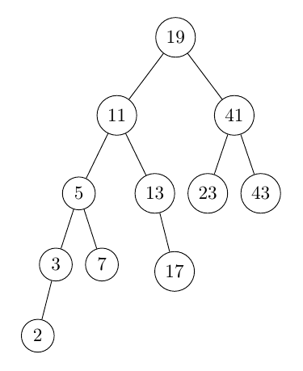

# pdb tutorial

This tutorial will teach you how to use basic python pdb commands, using a
binary tree traversal example.

First, run
~~~
c:\Users\rriley1>pdb_tutorial> python preorder_tree_traversal.py
# [19, 11 5, 3, 2, 7, 13, 17, 41, 23, 43]
~~~

*The output of preorder_tree_traversal.py is a preorder traversal of the binary tree below; in a preorder binary tree traversal, at each node, we record the node's value, then recursively visit the left subtree, followed by the right subtree. (You don't need to remember this definition for the tutorial! :) )*

To run pdb, you use `-m pdb` before any other arguments, including the file name. You can use other command line args as well!

Let's try pdb with our tree traversal program:
~~~
c:\Users\rriley1\pdb_tutorial> python -m pdb preorder_tree_traversal.py
~~~

Your console should print:

~~~
> c:\Users\rriley1\pdb_tutorial\preorder_tree_traversal.py(1)<module>()
> import Binary_Tree
(Pdb)
~~~

The first line refers to your literal location: the file path, and then the line number. The (1) means we're at the first line of the file: pdb always starts at the first line.
The next line is the contents of our current line (namely, line 1). We can see that we're importing a python class named Binary_Tree.
Lastly, we have the pdb console. This is where we can type commands.

First and foremost, we can use the command `c`  to execute the program (`cont` or `continue` work as well.)
~~~
(Pdb) c
[19, 11, 5, 3, 2, 7, 13, 17, 41, 23, 43]
The program finished and will be restarted
>  C:\Users\rriley1\pdb_tutorial\preorder_tree_traversal.py(1)<module>()
> import Binary_Tree
(Pdb)
~~~

And we use `q` to quit pdb (`exit` works as well.)
~~~
(Pdb) q
C:\Users\rriley1\pdb_tutorial>
~~~

To get back to pdb again, re-run
~~~
C:\Users\rriley1\pdb_tutorial> python -m pdb preorder_tree_traversal.py
~~~

## List (l)
The command `list` or `l` will print our current line (1) and the next 10 lines (through line 11) to the console. If we keep pressing `l`, it will print the subsequent 10 lines (12-21), and the next 10 after, until the end of the file (EOF).
~~~
(Pdb) l
  1  -> import Binary_Tree
  2
  3     GLOBAL_VARIABLE = "You found a global variable!"
  4
  5     # returns a list representing a preorder traversal of the nodes of the tree
  6     def preorder_traversal_list(binary_tree):
  7
  8         traversal = []
  9         if binary_tree.root is not None:
 10             traversal.append(binary_tree.root)
 11
~~~

Here we can see that the `preorder_tree_traversal` file first defines a function `preorder_traversal_list`, and we can see a bit of its implementation.

However, sometimes we want to see the entire function we're in (or frame), and we can use the `ll` or `longlist` command to achieve that.
~~~
(Pdb) ll
1  -> import Binary_Tree
2
3     GLOBAL_VARIABLE = "You found a global variable!"
4
5     # returns a list representing a preorder traversal of the nodes of the tree
6     def preorder_traversal_list(binary_tree):
7
8         traversal = []
9         if binary_tree.root is not None:
10             traversal.append(binary_tree.root)
11
12         if binary_tree.left is not None:
13             if isinstance(binary_tree.left, Binary_Tree.Binary_Tree):
14                 traversal.extend(preorder_traversal_list(binary_tree.left))
15             else:
16                 traversal.append(binary_tree.left)
17
18         if binary_tree.right is not None:
19             if isinstance(binary_tree.right, Binary_Tree.Binary_Tree):
20                 traversal.extend(preorder_traversal_list(binary_tree.right))
21             else:
22                 traversal.append(binary_tree.right)
23
24         return traversal
25
26     if __name__ == "__main__":
27         my_tree = Binary_Tree.build_sample_tree()
28         print(preorder_traversal_list(my_tree))
~~~

Because we're not inside any function at the moment, `ll` gives the entire file, and fortunately, this file is quite short! Although in most cases you could simply bring up the file in another terminal or application, opening the file can be inconvenient, especially if you're ssh'ing already.

We can also use arguments to specify what part of which files we want to see:
~~~
(pdb) l 12 # print lines 7-17 of preorder_tree_traversal.py (the 10 lines around line 12)
~~~
You can specify any line number as the first argument. If the line number is less than 7, `l` will always print the first 10 lines, and if the line number is less than 5 lines away from the end of the file, it will print the 5 lines preceeding and as many subsequent lines as it can. Try:
~~~
(pdb) l 2 # prints lines 1-11
(pdb) l 25 # prints lines 20-26

# We can also specify /until/ which line we want to print, using a second, comma-separated argument:
(pdb) l 2, 6 # prints only lines 2-6
~~~

We can only use `l` to peek inside the file we currently have open (here, preorder_tree_traversal.py.) If we try to look at another file, we'll get an error. (We'll discuss the syntax below in the "Breakpoints" section)
~~~
(Pdb) l Binary_Tree.py:1
*** Error in argument: 'Binary_Tree.py:1'
~~~

## Breakpoints (b)
We can specify a breakpoint with the command `b` followed by a line number. Whenever a breakpoint is encountered while running the program, execution pauses and we get the pdb console again.
~~~
(Pdb) b 24 # set a breakpoint at line 24 of the current file
Breakpoint 1 at C:\Users\rriley1\pdb_tutorial\preorder_tree_traversal.py:24
(Pdb) c
> C:\Users\rriley1\pdb_tutorial\preorder_tree_traversal.py(22)preorder_traversal_list()
-> return traversal
~~~
We can also make a breakpoint with a function name, and a line in another file:
~~~
(Pdb) b preorder_traversal_list # a function in our current file
Breakpoint 2 at C:\Users\rriley1\pdb_tutorial\preorder_tree_traversal.py:6

(Pdb) b Binary_Tree:20 # a line in another file, the syntax is My_File(.py):line_number
Breakpoint 3 at C:\Users\rriley1\pdb_tutorial\binary_tree.py:20

(Pdb) b Binary_Tree:build_sample_tree # !! a FUNCTION in ANOTHER file gives us an error, however
*** Bad lineno: build_sample_tree
~~~

To see a list of all breakpoints, use the command `b` without any arguments. Notice that it lists several properties of the breakpoint, including its position in the code, and how many time the breakpoint has been triggered.
~~~
(Pdb) b
Num Type         Disp Enb   Where
1   breakpoint   keep yes   at c:\users\rebecca\documents\haverford\pdb_tutorial\pdb_tutorial\preorder_tree_traversal.py:24
        breakpoint already hit 1 time
2   breakpoint   keep yes   at c:\users\rebecca\documents\haverford\pdb_tutorial\pdb_tutorial\preorder_tree_traversal.py:6
3   breakpoint   keep yes   at c:\users\rebecca\documents\haverford\pdb_tutorial\pdb_tutorial\binary_tree.py:20
~~~

*Extra: Recall that `ll` will display the current function or frame. Last time we weren't in a function, so it listed the entire file. Now we're inside a function (`preorder_traversal_list`), so try `ll` again. It should only display the function implementation (the function code), this time.*

### Important: Conditional Breakpoints
Sometimes we only want to pause execution if a particular condition is met. We can add a condition when making a new breakpoint using
~~~
b where_to_break, condition
~~~
or add a condition to an existing breakpoint using
~~~
condition breakpoint_number condition
~~~
Let's do some examples:
~~~
 # pause execution at line 14 only if the `traversal` list is empty
(Pdb) b 14, len(traversal) == 0
Breakpoint 4 at C:\Users\rriley1\pdb_tutorial\preorder_tree_traversal.py:14

# breakpoint 1 will now only pause execution if the `traversal` list has two or more elements
(Pdb) condition 1 len(traversal) > 1
New condition set for breakpoint 1.

# calling condition again will replace the previous condition with a new one
(Pdb) condition 1 len(traversal) > 0 && traversal[0] == 19
New condition set for breakpoint 1

# `condition` without any arguments will clear the condition
(Pdb) condition 1
Breakpoint 1 is now unconditional.
~~~
If you're totally done with a breakpoint, you can delete it with the command `cl` or `clear`.
~~~
# delete a breakpoint with its corresponding number
(Pdb) cl 4
Deleted breakpoint 4 at C:\Users\rriley1\pdb_tutorial\preorder_tree_traversal.py:14

# make a new breakpoint, notice that it's #5, not #4. We don't recycle breakpoint numbers.
(Pdb) b 1
Breakpoint 5 at C:\Users\rriley1\pdb_tutorial\preorder_tree_traversal.py:1

# delete a breakpoint by giving its file and line number
(Pdb) cl preorder_tree_traversal.py:1
# no message is displayed, but use `b` to see that breakpoint 5 is gone!
~~~
*extra exercise: what happens if we give details of a breakpoint that doesn't exist? Try the following: they all produce errors.*
~~~
(Pdb) cl 4 # we had a breakpoint 4, but deleted it!
(Pdb) cl 256 # we only have 3 breakpoints, not 256!
(Pdb) cl preorder_tree_traversal.py:1 # we don't have a breakpoint here!
~~~

##### Extra: Continue (c) and Help (h)

*You may have noticed that the command "c" ran until a breakpoint was reached. This is the function of "c". You can confirm this with the "help" or "h" command. The "h" command by itself will list all possible commands, while "h" followed by a command will give the help information for that command.*
~~~
(Pdb) h c
c(ont(inue))
        Continue execution, only stop when a breakpoint is encountered.
(Pdb)
~~~

##### Extra: Restart and CTRL-C
*If your program is paused in execution (at a breakpoint) but you don't want to continue running it, you can use `restart` to terminate execution.*
~~~
(Pdb) restart
Restarting preorder_tree_traversal.py with arguments:
        preorder_tree_traversal.py
> C:\Users\rriley1\pdb_tutorial\preorder_tree_traversal.py(1)<module>()
-> import Binary_Tree
~~~
*Sometimes your program will continue to execute for a while without stopping. You might be stuck in a loop, or you're just doing heavy-duty computation! If you want to force quit/cancel execution you can use `CTRL-C` (hold down the control key, then hit "C") and  it will pause execution and bring up the pdb terminal.)*

*extra exercise:
*If you have `preorder_tree_traversal.py` currently open in `pdb`, exit using the `q` command, and then follow the example below:
~~~
C:\Users\rriley1\pdb_tutorial>python -m pdb bad_1.py

> C:\Users\rriley1\pdb_tutorial\bad_1.py(1)<module>()
-> if __name__ == "__main__":
(Pdb) c
# ...
# ...
# ... sure is taking a while! Use CTRL-C to quit. pdb will display the current line we're on, but...
(Pdb) ll # display the entire file we're working on. Were we "stuck", and if so, why?
~~~

## Print (p)
While we're at a breakpoint, we can examine our variables using the command `p`. This is very useful in debugging! If you can't remember what local variables are available in that frame (function,) use `l` to see the code again.
Here are some examples (run `python -m pdb preorder_tree_traversal.py`, set a breakpoint at line 24-- `b 24`-- and then use `c` (continue) to get these results):
~~~
(Pdb) p traversal # a variable local to our function
[3, 2]
(Pdb) p binary_tree.root # an attribute of a local variable
3
(Pdb) p binary_tree.left
2
(Pdb) p binary_tree.right
None
(Pdb) p binary_tree # string representation of a custom class
<Binary_Tree.Binary_Tree object at 0x000001FC27A8CF40>
(Pdb) p GLOBAL_VARIABLE # we can also see global variables!
'You found a global variable!'
(Pdb) p nonexistent_variable # throws an error
*** NameError: name 'nonexistent_variable' is not defined
~~~

We can also use functions and computations here!
~~~
(Pdb) p type(traversal) # a built-in python function
<class 'list'>
(Pdb) p binary_tree.root + binary_tree.left # arithmetic!
5
~~~

##### Aside: whatis
*`Whatis variable` is an alias for (does the same thing as) `p type(variable)`. Try `whatis traversal` to see it in action, and `h whatis` for an explanation of the command.*

## Up (u) and Down (d)
The last commands I want to highlight are very important in function calls, particularly in recursion or multi-layer abstractions. The command `u` moves us up the stack (to the function call that put us where we are now) and `d` moves us back down the stack. Run `python -m pdb preorder_tree_traversal.py`, set a breakpoint at line 24 (`b 24`) and then use `c` (continue) if you aren't already at `preorder_tree_traversal.py` line 24.
~~~
> C:\Users\rriley1\pdb_tutorial\preorder_tree_traversal.py(24)preorder_traversal_list()
-> return traversal
# go up the stack!
(Pdb) u

# this means line 14 called preorder_traversal_list, and that function call hit the breakpoint at line 24
> C:\Users\rriley1\pdb_tutorial\preorder_tree_traversal.py(14)preorder_traversal_list()
-> traversal.extend(preorder_traversal_list(binary_tree.left))

(Pdb) u # keep going up

# because line 14 is the first recursive call, we're here for a while. Continue to use the command `u` (just hitting enter will use your last command as well) until you get to a different line.

# this is the original function call!
> C:\Users\rriley1\pdb_tutorial\preorder_tree_traversal.py(33)<module>()
-> print(preorder_traversal_list(my_tree))

(Pdb) d # let's go back down
> C:\Users\rriley1\pdb_tutorial\preorder_tree_traversal.py(14)preorder_traversal_list()
-> traversal.extend(preorder_traversal_list(binary_tree.left))
~~~

Be sure to try `(Pdb) h` to see a list of all possible commands, and to explore them! Now that you've completed this tutorial, move on to Guided_pdb_tutorial.md for a guided debugging of a broken inorder tree traversal.
